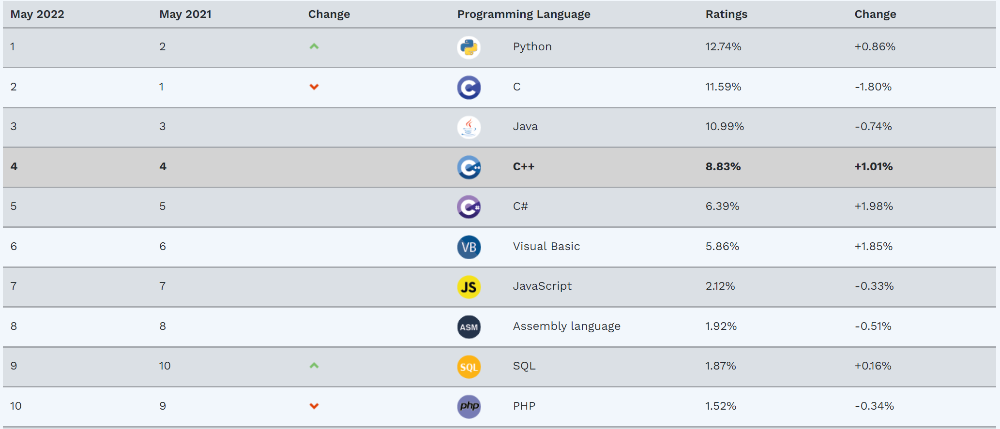
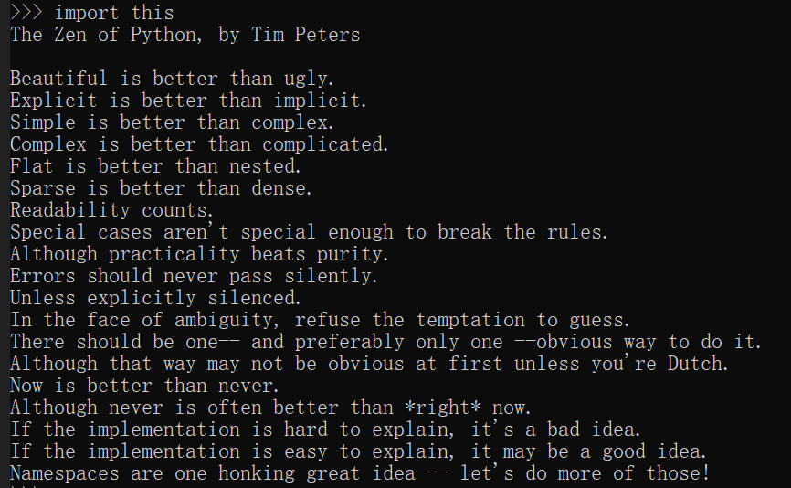

# 什么是编程语言？

用来和计算机交流，控制计算机，让计算机按照我们的要求做事情，这样的语言叫做编程语言。


# 编程语言的发展历程？

计算机语言经历了3个阶段：机器语言、汇编语言、高级语言

**机器语言**：用二进制编码表示的机器指令，是CPU能直接识别并执行的唯一一种语言

**汇编语言**：符号语言。用与机器指令含义相近的英文缩写、字母和数字等符号来取代机器指令

**高级语言**：机器语言和汇编语言都是面向机器(硬件)的语言，占用内存空间少，运行速度快，但用起来繁琐费时，通用性差；而高级语言是面向用户的语言，更接近人类的自然语言，且无论何种机型的计算机，只要配备上相应的高级语言的编译或解释程序，就可以实现通用


# 编译型语言 & 解释型语言？

用任何编程语言来开发程序，都是为了让计算机干活，而计算机干活的CPU只认识机器指令，所以，尽管不同的编程语言差异极大，最后都得“翻译”成CPU可以执行的机器指令。这种“翻译”通常有两种方式，即编译方式和解释方式

**编译方式**：源代码文件经过编译器翻译成目标程序文件（机器语言表示），然后计算机再执行该目标程序。

**解释方式**：源代码文件经过解释器逐句输入逐句翻译，且计算机一句句执行，并不产生目标程序文件。


# Python 是什么样的语言?

Python是著名的“龟叔”Guido van Rossum（吉多·范罗苏姆，出生成长于荷兰，现美国国籍）在1989年圣诞节期间，为了打发无聊的圣诞节而编写的一个编程语言。现在，全世界差不多有600多种编程语言，但流行的编程语言也就那么20来种。TIOBE 排行榜（每月更新一次）很好的反映了各个编程语言的热门程度

TIOBE 排行榜：https://www.tiobe.com/tiobe-index/




# Python 环境搭建

**Python 安装**

- 官方宣布，2020 年1月1日，停止 Python 2 的更新。Python 2.7 被确定为最后一个 Python 2.x 版本。Python 3 和 Python 2 还是有差别的，所以现在学习 Python，通常选择 Python 3.x 。大家可以根据情况选择不同的 Python 3.x 版本安装

- 建议直接安装 anaconda，它是一个开源的 Python 发行版本，其包含了conda、Python等180多个科学包及其依赖项。这样会比单独安装 Python，再去安装一堆的工具包更省事

- anaconda 官方下载地址：https://www.anaconda.com/products/individual

- anaconda 清华镜像下载地址（推荐）：https://mirrors.tuna.tsinghua.edu.cn/anaconda/archive/?C=M&O=D

**IDE 安装**

- 安装好 Python 之后就可以在命令行写程序了，但是会发现用命令行写代码不是很方便，所以就可以使用 IDE（集成开发环境）来写代码，因为 IDE 集成了代码编写功能、分析功能、编译功能、调试功能等一体化的开发软件服务，可以大大提升我们的工作效率
- 主流的 Python IDE 有：Vim、VSCode、PyCharm、Jupyter 等等，个人使用 VSCode
- 完全可以根据个人的习惯选择不同的 IDE
- VSCode 官方下载地址：https://code.visualstudio.com/


# Python 之禅（Zen of Python）

这是 Python 的一个小彩蛋，执行 import this，会输出一段文字，这段文字可以理解为 Python 中的『八荣八耻』。Python 之禅列出了 Python 设计的原则与哲学，有助于理解与使用这种语言。作者是 Tim Peters



翻译如下：

• 优美胜于丑陋（Python 以编写优美的代码为目标）

• 明了胜于晦涩（优美的代码应当是明了的，命名规范，风格相似）

• 简洁胜于复杂（优美的代码应当是简洁的，不要有复杂的内部实现）

• 复杂胜于凌乱（如果复杂不可避免，那代码间也不能有难懂的关系，要保持接口简洁）

• 扁平胜于嵌套（优美的代码应当是扁平的，不能有太多的嵌套） 

• 间隔胜于紧凑（优美的代码有适当的间隔，不要奢望一行代码解决问题）  

• 可读性很重要（优美的代码是可读的）

• 即便假借特例的实用性之名，也不可违背这些规则（这些规则至高无上）  

• 不要包容所有错误，除非你确定需要这样做（精准地捕获异常，不写 except:pass 风格的代码）

• 当存在多种可能，不要尝试去猜测 

• 而是尽量找一种，最好是唯一一种明显的解决方案（如果不确定，就用穷举法）

• 虽然这并不容易，因为你不是 Python 之父（这里的 Dutch 是指作者 Guido ） 

• 做也许好过不做，但不假思索就动手还不如不做（动手之前要细思量）

• 如果你无法向人描述你的方案，那肯定不是一个好方案；反之亦然（方案测评标准）

• 命名空间是一种绝妙的理念，我们应当多加利用（倡导与号召）


# VSCode 基本操作

- 通过 VSCode 查看 Python 语法提示、报错提示以及调试代码（debug）

<!-- conda init powershell
conda env list -->

```python
print("执行第1行啦")
print(2 / 0)  # 报错
print("执行第3行啦")
a = 123

def add(left, right):
    print("执行第7行啦")
    print("执行第8行啦", left + right)

print("执行第10行啦")
add(3, 4)
a = 124
print("执行第13行啦")
```