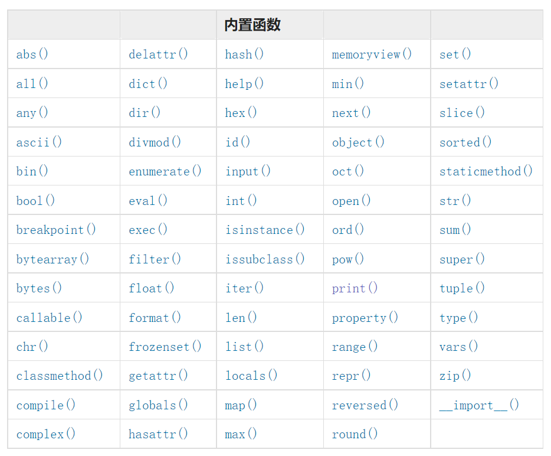

# 基础语法

## 行结构

- 一个 Python 程序可分为许多逻辑行，一般来说：一个语句就是一行代码，不会跨越多行

- 比如下面的 Python 程序，一共有3个逻辑行，每一行都通过 print() 输出一个结果

~~~python
print(123)
print(456)
print(123456)
~~~

- 而如果是下面这种写法，程序执行是会报错的，因为 print() 一个语句跨越了 2 行

```python
print(12
3)
print(4
56)
print(123
456)
```

- 也可以把多个语句利用英文输入下的分号（ ;）写在一行之内，不过通常我们不这么做

```python
print(123); print(456); print(123456)
```

- 也有语句是可以跨越多行的，比如：复合语句。复合语句可由多行子语句组成，通常它会跨越多行

- 比如下面的 if ... else ... 语句就是一个复合语句，它跨越了多行

```python
a = 4
if a < 3:
    print(True)
else:
    print(False)
```

- 有的时候，整个复合语句也可能包含于一行之内

- 下面这种写法，叫做三元表达式，它把 if ... else ... 复合语句写在了一行之内

```python
a = 4
print(True) if a < 3 else print(False)
```


## 缩进

- 一个逻辑行开头处的空白被用来计算该行的缩进等级，以决定语句段落的组织结构

- 比如前面提到的 if 语句，可以看到这里的第一个 print() 前面是有空白的，这就是缩进，它说明了第一个 print() 是 if 语句的下级，第二个 print() 前面没有缩进，那么它和 if 语句是平级的。如果 if 条件不成立，那么第一个 print() 不会执行，因为它是 if 语句的下级，而第二个 print() 仍会执行，因为它和 if 语句是平级的，并会不受 if 条件的影响

```python
a = 4
if a < 3:
    print(True)
print(789)
```

- 在 IDE 中写程序时，需要缩进的语句，一般敲回车换行会自动缩进的，一般是占 4 个空格，我们在写代码需要缩进时通常用 Tab 键，而不用按 4 次空格（Tab 键一般可以把光标缩进 4 个空格，通常这是 IDE 可设置的）

- 缩进的空格数是可变的，并非固定 4 个空格，但是同一个代码块的语句必须包含相同的缩进空格数

```python
a = 4
if a < 3:
  print(True)
     print(123)  # 这个缩进不对，同为if语句下的代码，应该和上面一个print缩进一样
else:
       print(False)  # 这个缩进没问题，它在else语句下面，可以和if语句下的print缩进不一样
print(789)  # 这个print是在if...else...语句外面的，是平级的，不需要缩进
```


## 注释

- 注释在 Python 解释器的语法分析中会被忽略。通说的说，注释是给人看的，而程序执行时会被无视

- 单行注释：以 # 开头

- 多行注释：每行都用一个 # 开头，或者用 三引号（可单 ''' 、可双 """）把注释内容包起来

```python
print(1234)
# 第一个注释
# 第二个注释

'''
第三个注释
三引号可以多行注释
'''

"""
第四个注释
三引号可以多行注释
"""
print("Hello, Python!")  # 第五个注释
```


## 拼接

- 显式的行拼接：Python 通常是一行写完一条语句，但如果语句很长，我们可以使用反斜杠（\）来实现多行语句

```python
""" 下面 a,b 两种写法都是可以的，结果是一样的 """
a = 1 + 2 + 3

b = 1 + \
    2 + \
    3
```

- 隐式的行拼接：圆括号、方括号或花括号以内的多行语句，无需使用反斜杠（\）

```python
month_names = ['Januari', 'Februari', 'Maart',      # These are the
               'April',   'Mei',      'Juni',       # Dutch names
               'Juli',    'Augustus', 'September',  # for the months
               'Oktober', 'November', 'December']   # of the year
```


## 变量

- 变量就是可以变化的量。是计算机语言中能储存计算结果或能表示值的抽象概念

- 变量需要先定义再使用，解释器执行到变量定义的代码时会申请内存空间存放变量值，然后将变量值的内存地址绑定给变量名

- 变量的定义由三部分组成：
  1. 变量名：指向值所在的内存地址，通过它访问值
  2. 等于号（=）：赋值符号，用来将数据的内存地址绑定给变量名
  3. 值：变量的值就是内存地址对应存储的数据

- 标识符：用于变量、函数、类、模块等的名称

- 标识符命名规范：
  1. 变量名只能包括字母、数字和下划线；变量名不能以数字开头
  2. 变量名不能包括空格，可以使用下划线来分隔多个单词
  3. 不能使用 Python 的关键字及内置函数名作变量名
  4. 变量名要尽量简短及具描述性，尽量做到短小精悍，见名知义
  5. Python 中变量名是区分大小写的，例如，Name 和 name 是两个不同的变量名
  6. 可参考：驼峰命名法

- 关键字查询：

```python
help("keywords")
```

```python
import keyword

print(keyword.kwlist)
```

- 内置函数：

  1. Python 解释器内置了很多函数和类型，可以直接使用它们

     

  2. 查看 Python 的内置函数

     ```python
     import builtins
     
     
     print(dir(builtins))
     ```


## 常量

- 常量就是不变化的量。在程序运行过程中，有些值是固定的、不应该被改变，比如圆周率 3.141592653...

- 所以单从语法层面去讲，常量的使用与变量完全一致


# 输出 & 输入

## 输出

print(*objects, sep=' ', end='\n', file=sys.stdout, flush=False)

- objects：输出的对象，输出多个对象时，需要用 , 分隔，对象会被转成字符串再输出
- sep：输出的对象用什么间隔开来，默认值是一个空格
- end：输出最后用什么结尾，默认值是换行符 \n
- file：要写入的文件对象，默认为sys.stdout，指向控制台
- flush：通常输出是否被缓存决定于 flush ，如果 flush 参数为 True，会被强制刷新

```python
print("Hello Python!")
```

```python
with open("./abc.txt", 'w') as f:
    print(12345, file=f)  # 把12345直接写入abc.txt文件
```

```python
import time


print(1, 2, 3, sep="-", end="\n\n")
print("Loading", end="")
for i in range(10):
    # 如果这里flush为False，则要等10次循环结束之后，终端才会现实结果
    # 而flush为True，则每次循环都会刷新一次结果，看起来就是动态的效果
    print(".", end='', flush=True)
    time.sleep(0.3)  # 延迟0.3秒再往后执行
```


## 输入

input([prompt])

- prompt: 提示信息，string 类型

- 函数接受一个标准输入数据，返回为 string 类型

```python
name = input("请输入你的姓名：")
print(name, "您好，很高兴认识你！")
```