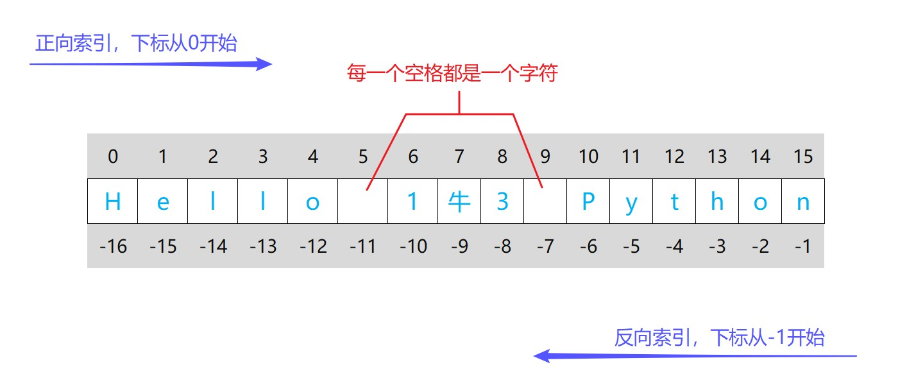

# 标准数据类型

Python 3 中有六个标准的数据类型：

- 数字（Number）
- 字符串（String）
- 列表（List）
- 元组（Tuple）
- 字典（Dictionary）
- 集合（Set）


## 数字（Number）

- 特点：Number 是不可变的，它不是序列
- 分类：整数（int）、浮点数（float）、布尔型（bool）、复数（complex）

整数（int）

- 理论上可以无限大或者无限小，但是受内存的限制，数字越多需要的内存越大，例：999999...、-9999、0、1234

浮点数（float）

- 带一个小数点，也可以加一个科学计数标志e或者E， 例：1.23、1.、3.14e-10、4E210、4.0e+210（科学计数法：a×10^b 表示为 aEb 或 aeb）

布尔型（bool）

- 在 Python2 中，没有布尔型，它用数字0表示False，用1表示True；
  在 Python3 中，把 True 和 False 定义成关键字了，但是他们的值还是1和0，它们可以和数字相加

复数（complex）

- 实部+虚部，和数学中 a+bi 是一样的，只不过这里的虚部是以 j 或者 J 结尾，例：a = 2 + 1j 、 b = 1J（注意：j 或 J 前面的系数不能省略）


**数字类型转换**

type(object)

- 返回 object 的类型


int([x], base=10)

- x：数字或字符串
- base：进制数，默认十进制（要用其他进制时，x必须为字符串）
- 将 x 转换为整数并返回，如果没有指定 x，则返回 0

```python
a = int()  # 不传入参数时，返回0
print(a)  # 0

a = int(3.99)  # 将浮点型转为整型,直接舍弃小数点后面的数
print(a)  # 3

a = int("12")  # 把整数型字符串"12"转为整型
print(a)  # 12

# a = int("12.1")  # 浮点型的字符串是不行的，会报错
# print(a)

a = int("101010", base=2)  # 基于2进制的"101010"转为十进制的整型
print(a)  # 42

a = int("0b101010", base=2)  # 前面加0b说明是二进制，结果同上
print(a)  # 42

a = int("11", base=8)  # 基于8进制的"11"转为十进制的整型
print(a)  # 9

a = int("0o11", base=8)  # 前面加0o说明是八进制，结果同上
print(a)  # 9

a = int('17', base=16)  # 基于16进制的"17"转为十进制的整型
print(a)  # 23

a = int('0x17', base=16)  # 前面加0x说明是十六进制, 结果同上
print(a)  # 23
```

float([x])

- x：数字或数字型字符串
- 将 x 转换成浮点数并返回，不传入参数，则返回 0.0
- 字符串两头的空格不影响

```python
a = 123
b = "123"
c = "1.23"

print(float())  # 0.0

a1 = float(a)
print(a1)  # 123.0

b1 = float(b)
print(b1)  # 123.0

c1 = float(c)
print(c1)  # 1.23
```

bool([x]) 

- 将给定参数转换为布尔类型，True 或 False
- 如果没有参数，返回 False

```python
# 不管x是什么类型，只要不为空, None 或数字0，False 就返回True
print(bool())  # 没有参数，返回False
print(bool(0))  # 0判断为False
print(bool(None))  # None判断为False
print(bool([]))  # 空的都判断为False
print(bool(1))  # True
print(bool(2))  # True
print(bool("0"))  # True
```

complex([real[, imag]])

- 创建一个值为 real + imag * j 的复数或者转化一个字符串或数为复数
- 如果没有参数，则返回 0j

```python
# 如果没有参数，则返回 0j
print(complex())  # 0j

# 传入两个数字，返回值为 real + imag*1j 的复数
print(complex(3.2, 1))  # (3.2+1j)

# 只传入一个数字，imag则默认为0
print(complex(3.2))  # (3.2+0j)

# 如果第1个参数是字符串，则它被解释为一个复数，不能传第2个参数，第2个参数不能是字符串
print(complex("3.2"))  # (3.2+0j)
print(complex("3.2+1j"))  # (3.2+1j)，注意："+"号两边不能有空格，否则报错
```


## 字符串（String）

- 特点：String 是不可变的，它是序列
- 单行字符串：用一对单引号或一对双引号定义
- 多行字符串：用（单引号或双引号组成的）一对三引号来定义
  （前面提到一对三引号还可以用作多行注释，前面加 # 是单行注释）

```python
s1 = 'hello world'  # 一对单引号定义单行字符串

s2 = "hello world"  # 一对双引号定义单行字符串

# 单引号组成的一对三引号定义多行字符串
s3 = '''hello world 
hello China'''

# 双引号组成的一对三引号定义多行字符串
s4 = """hello world 
hello China"""

""" 这是一个多行的
 注释，它不会被程序运行"""
```

引号用来定义字符串，那么该如何输出引号？

```python
# 利用转义字符, \后面的引号会被认定为字符串输出
print("\"\"")

# 利用单引号, 外面的单引号代表定义字符串, 里面的双引号是字符串的内容
print('""')

# 利用单引号组成的三引号, 外面的三引号代表定义字符串, 里面的双引号是字符串的内容
print('''""''')
```


str(object='')

- 返回 object 的字符串格式，object默认为空字符串，所以不传参时，返回空字符串

```python
print(str())
print(str(123456))
```


**转义字符**

要在字符串中使用特殊字符时，用反斜杠 \ 转义字符（标亮部分要求掌握，其他作为了解即可）

| 转义字符     | 描述                                  |
| ------------ | ------------------------------------- |
| \ (在行尾时) | 续行符                                |
| ==\\\\==     | 反斜杠符号                            |
| ==\\'==      | 单引号                                |
| ==\\"==      | 双引号                                |
| ==\n==       | 换行                                  |
| \b           | 往前退一格                            |
| \r           | \r  后面的内容把前面的覆盖掉          |
| ==\t==       | 横向制表符（字符和空格一起占8个字符） |
| \a           | 响铃（在cmd中会响）                   |
| \000         | 空字符                                |


**Raw 字符串**

很多时候我们并不希望字符串转义，比方说在输入一串网址的时候，里面正好有反斜杠和字母造成了转义，此时为了让该字符串不转义，可以在字符串前面加一个字母 r，表示原始字符串，所有转义都不进行，也就是起到了抑制转义的效果。

```python
print("123\
456")  # 续行符

print("123\\456")  # 反斜杠符号
print('123\'456')  # 单引号
print("123\"456")  # 双引号
print("123\n456")  # 换行
print(r"www.baidu.com\n")  # 原始字符串
print(R"www.baidu.com\n")  # 原始字符串
```


**字符串格式化**

① % 格式化符号（传统格式化方法）

字符串格式化符号：（标亮部分要求掌握，其他作为了解即可）

| 符号       | 描述                                                         |
| ---------- | ------------------------------------------------------------ |
| ==%s==     | 格式化为字符串，采用 str() 显示                              |
| %r         | 格式化为字符串，采用 repr() 显示                             |
| ==%d、%i== | 格式化为十进制整数，仅适用于数字                             |
| ==%f、%F== | 格式化为浮点数，可指定小数点后的精度，仅适用于数字           |
| %c         | 格式化为字符（ASCII码），适用于整数和字符                    |
| %o         | 格式化为八进制数，仅适用于整数                               |
| %x、%X     | 格式化为十六进制数，仅适用于整数                             |
| %e、%E     | 格式化为科学计数法表示，仅适用于数字                         |
| %g、%G     | 保留6位有效数字，整数部分大于6位则用科学计数法表示，考虑四舍五入，仅适用于数字 |


chr(i)   /    ord(c)

- chr(i) 返回 Unicode 码位为整数 i 的字符，它是 ord() 的逆函数
- ord(c) 返回单字符对应的 Unicode 码位，它是 chr() 的逆函数

```python
print(chr(97))
print(ord('a'))
```

```python
import datetime

# %f默认精确到小数点后6位
print("它说它叫%s, 今年%d岁, 每天睡%f小时!" % ("旺财", 2, 8.5))

print("它说它叫%s, 擅长%s!" % ("旺财", "汪汪汪"))
print("它说它叫%r, 擅长%r!" % ("旺财", "汪汪汪"))
d = datetime.date.today()
print("%s" % d)
print("%r" % d)

print("%c,%c,%c,%c" % (65, 90, 97, 122))
print("%c,%c,%c,%c" % ("A", "Z", "a", "z"))

print("%o" % 20)
print("%x, %X" % (28, 28))

print("123用科学计数法表示为%e" % 123)
print("123用科学计数法表示为%E" % 123)

print("%g" % 1.23456789)  # 保留6位有效数字, 考虑四舍五入
print("%g" % 123456.789)  # 保留6位有效数字, 考虑四舍五入
print("%g" % 1234567.89)  # 保留6位有效数字, 整数部分大于6位则用科学计数法表示
print("%G" % 123456789)  # 大写G, 科学计数法时就用大写E表示
```

在格式化输出**数字或字符串**时，可以附加辅助指令来完善格式化操作：

| 指令 | 功能                                                         |
| ---- | ------------------------------------------------------------ |
| -    | 左对齐显示，默认是右对齐                                     |
| +    | 在正数前面显示 +                                             |
| #    | 在八进制数前面显示 '0o'，在十六进制前面显示 '0x' 或者 '0X'（取决于用的是'x'还是'X'） |
| 0    | 显示的数字前面填充'0'，而不是默认的空格                      |
| m.n  | m和n为整数，可以组合或单独使用。其中m表示最小显示的总宽度，如果超出，则原样输出;   n表示可保留的小数点后的位数或者字符串的个数 |
| *    | 定义最小显示宽度或者小数位数                                 |

```python
PI = 3.141592653
print("pi1 = %10.3f" % PI) # 最小显示总宽度为10，保留小数点后3位
print("pi2 = %.*f" % (5, PI)) # 定义精确到小数点后5
print("pi3 = %*f" % (12, PI)) # 定义最小显示宽度为12，%f默认精确到小数点后6位
print("pi4 = %010.3f" % PI) # 用0填充空白
print("pi5 = %-10.3f" % PI) # 左对齐，总宽度10个字符，精确到小数点后3位
print("pi6 = %+f" % PI) # 在正数前面显示正号

print("%o" % 12)
print("%#o" % 12)  # 在八进制数前面显示 '0o'
print("%x" % 24)
print("%#x" % 24)  # 在十六进制前面显示 '0x'
print("%X" % 24)
print("%#X" % 24)  # 在十六进制前面显示 '0X'
```

② format 格式化函数（Python2.6 新增）

```python
# {}是占位符, 当里面为空时, 默认从左往右选择数据
a = "它说它叫{}, 它今年{}岁, 它宝宝{}个月了!".format("旺财", 2, 3)
print(a)

# 占位符可以填入右边数据的顺序索引来填入对应数据
b = "它说它叫{1}, 它今年{0}岁, 它宝宝{2}个月了!".format(2, "旺财", 3)
print(b)

# 还可以通过关键字来赋值
c = "它说它叫{name}, 它今年{age01}岁, 它宝宝{age02}个月了!".format(name="旺财", age01=2, age02=3)
print(c)

# format格式化函数的复用性
d = "它说它叫{name}, 它今年{age}岁, 它宝宝{age}个月了!".format(name="旺财", age=2)
print(d)
```

```python
"""
:后面可以附带填充的字符，默认为空格
^、<、> 分别表示居中、左对齐、右对齐，后面附带宽度限定值
使用b、d、o、x 分别输出二进制、十进制、八进制、十六进制数字
使用逗号（,）输出金额的千分位分隔符  """
print('{:>8}'.format('1')) # 总宽度为8，右对齐，默认空格填充
print('{:0>8}'.format('1')) # 总宽度为8，右对齐，使用0填充
print('{:a<8}'.format('1')) # 总宽度为8，左对齐，使用a填充

print('{:.2f}'.format(3.141592653)) # 浮点数精确到小数点后2位
print('{:8.2f}'.format(3.141592653)) # 浮点数精确到小数点后2位, 总宽带为8
print('{:<8.2f}'.format(3.141592653)) # 浮点数精确到小数点后2位, 总宽带为8, 左对齐
print('{:a<8.2f}'.format(3.141592653)) # 浮点数精确到小数点后2位, 总宽带为8, 左对齐, 填充a

num = 100
print('{:b}'.format(num)) # 1100100
print('{:d}'.format(num)) # 100
print('{:o}'.format(num)) # 144
print('{:x}'.format(num)) # 64

print('{:,}'.format(1234567890)) # 1,234,567,890
```

③ f-string（Python3.6 新增，==推荐==）

```python
name = "WangCai"
age = 2

# f-string用大括号 {} 表示被替换字段，其中直接填入替换内容：
print(f"它说它叫{name}, 它{age}岁, 它宝宝{age}月了!")

# f-string的大括号 {} 可以填入表达式或调用函数，Python会求出其结果并填入返回的字符串内：
print(f"它说它叫{name}, 它{2+2}岁, 它宝宝{age}月了!")
print(f"它说它叫{name.upper()}, 它{4//2}岁, 它宝宝{age}月了!")
```

```python
"""
:后面可以附带填充的字符，默认为空格
^、<、> 分别表示居中、左对齐、右对齐，后面附带宽度限定值
使用b、d、o、x 分别输出二进制、十进制、八进制、十六进制数字
使用逗号（,）输出金额的千分位分隔符  """
num = 1
print(f'{num:>8}') # 总宽度为8，右对齐，默认空格填充
print(f'{num:0>8}') # 总宽度为8，右对齐，使用0填充
print(f'{num:a<8}') # 总宽度为8，左对齐，使用a填充

PI = 3.141592653
print(f'{PI:.2f}') # 浮点数精确到小数点后2位
print(f'{PI:8.2f}') # 浮点数精确到小数点后2位, 总宽带为8
print(f'{PI:<8.2f}') # 浮点数精确到小数点后2位, 总宽带为8, 左对齐
print(f'{PI:a<8.2f}') # 浮点数精确到小数点后2位, 总宽带为8, 左对齐, 填充a

num = 100
print(f'{num:b}') # 1100100
print(f'{num:d}') # 100
print(f'{num:o}') # 144
print(f'{num:x}') # 64

print(f'{1234567890:,}') # 1,234,567,890
```


**字符串对象方法**

str.replace(old, new[, count])

- old：旧字符串
- new：新字符串
- count：要替换的最大次数，默认为-1，替换所有能替换的
-  用新字符串替换旧字符串并返回

```python
s = "Line1 Line2 Line4"

# 用 "b" 替换所有的 "Li"
rs = s.replace("Li", "b")
print(rs)  # bne1 bne2 bne4

# 用 "b" 替换 "Li" 2次
rs = s.replace("Li", "b", 2)
print(rs)  # bne1 bne2 Line4
```

str.strip([chars]) 

- chars：指定要移除的字符序列，如果没有指定，则默认移除空白符（空格、换行符、制表符等）
- 从字符串左右两边删除指定的字符序列（会考虑chars的所有组合）
- str.lstrip([chars]) 、str.rstrip([chars]) 也是同理，只不过一个是从左边删除，一个从右边删除而已

```python
str1 = ' \thello wrold h \n'
# 没有传参，删除字符串两边的空白符（空格、换行符、制表符）
print(str1.strip())  # hello wrold h

str2 = "ooho hello wrold"
# 移除str2头尾的字符"o"，头部有两个连续的，都移除，尾部没有可以移除的
print(str2.strip('o'))  # ho hello wrold

# 会考虑"mecow."的所有组合情况来移除头尾的字符
str3 = 'www.example.com'
print(str3.strip("mecow."))  # xampl
```

str.center(width[, fillchar])

- width：指定字符串长度
- fillchar：填充的字符，必须是单个字符，默认为空格
- 返回长度为 width 的字符串，原字符串在其正中，使用指定的 fillchar 填充两边的空位；如果 width 小于等于 len(s) 则返回原字符串
- 当左右填充不平衡时，原字符串长度为奇数时，左边填充更少，原字符串长度为偶数时，左边填充更多

```python
str1 = "hello "
print(str1.center(11, "F"))
print(str1.center(3, "F"))
```

str.ljust(width[, fillchar])

- width：指定字符串长度
- fillchar：填充的字符，必须是单个字符，默认为空格符
- 返回长度为 width 的字符串，原字符串在其中靠左对齐，使用指定的 fillchar 填充空位；如果 width 小于等于 len(s) 则返回原字符串
- str.rjust(width[, fillchar]) 也是同理，只不过原字符串在其中靠右对齐

```python
str1 = "hello "
print(str1.ljust(11, "F"))
print(str1.ljust(3, "F"))

print(str1.rjust(11, "F"))
print(str1.rjust(3, "F"))
```

str.partition(sep)

- sep：分隔符，可以是字符或者字符串
- 在 sep 首次出现的位置拆分字符串，返回一个包含三个元素的元组，元素分别是分隔符之前的部分、分隔符本身，以及分隔符之后的部分。 如果分隔符未找到，则返回的元组包含原字符串本身以及两个空字符串。
- str.rpartition(sep) 也是同理，只不过是从最后一次出现的位置拆分；未找到分隔符返回的元组包含两个空字符串以及原字符串本身。其他一样。

```python
str1 = "hello world"
print(str1.partition("l"))
print(str1.partition("ll"))
print(str1.partition("hd"))

print(str1.rpartition("l"))
print(str1.rpartition("ll"))
print(str1.rpartition("hd"))
```

str.startswith(prefix[, start[, end]])

- prefix：匹配的前缀，可以是字符，字符串或者它们组成的元组（元组中只要一个元素满足即可） 
- start：开始索引
- end：结束索引（不包括该索引）
- 如果字符串以指定的 prefix 开始，返回 True，否则返回 False；如果有可选项 start，将从所指定位置开始检查； 如果有可选项 end，将在所指定位置停止比较

```python
str1 = "hello world"
print(str1.startswith("h"))
print(str1.startswith("he"))
print(str1.startswith(" w"))
print(str1.startswith(" w", 5, 8))
print(str1.startswith((" w", "h")))
```

str.endswith(suffix[, start[, end]])

- suffix：匹配的后缀，可以是字符，字符串或者它们组成的元组（元组中只要一个元素满足即可） 
- start：开始索引
- end：结束索引（不包括该索引）
- 如果字符串以指定的 suffix 结束，返回 True，否则返回 False；如果有可选项 start，将从所指定位置开始检查； 如果有可选项 end，将在所指定位置停止比较

```python
str1 = "hello world"
print(str1.endswith("d"))
print(str1.endswith("ld"))
print(str1.endswith("lo"))
print(str1.endswith("lo", 1, 5))
print(str1.endswith(("d", "lo")))
```

str.isalnum()  如果字符串中的所有字符都是字母、文字或数字，则返回 True，否则为 False
str.isalpha()  如果字符串中的所有字符都是字母、文字，则返回 True，否则为 False
str.isdigit()  如果字符串中的所有字符都是数字，则返回 True，否则为 False
str.isspace()  如果字符串中只有空白符（空格、换行符、制表符等），则返回 True，否则为 False

```python
str1 = "abc牛123"
print(str1.isalnum())  # True

print(str1.isalpha())  # False
str2 = "abc"
print(str2.isalpha())  # True

print(str1.isdigit())  # False
print(str2.isdigit())  # False
str3 = "123"
print(str3.isdigit())  # True

print(str1.isspace())  # False
str4 = " "
print(str4.isspace())  # True
str5 = "\t"
print(str5.isspace())  # True
str6 = "\n"
print(str6.isspace())  # True
```

str.split(sep=None, maxsplit=-1)

- sep：用于分割字符串的分隔符,  默认为所有的空白符（空格、换行、制表符等）, 并丢弃结果中的空字符串
- maxsplit：最大分隔次数，默认为-1，即分隔所有
- 通过指定分隔符对字符串进行分割, 以字符串列表的形式返回（分割结果不包括分隔符）
- str.rsplit(sep=None, maxsplit=-1) 也是同理，只不过是maxsplit从右边开始

```python
s = " Line1-abcdef   \nLine2-abc \nLine4-abcd"

# 默认按照所有的空白符(空格、换行、制表符等)来分割, 并从结果中丢弃空字符串
a = s.split()
print(a)

# 按照指定的一个空格" "来分割
a = s.split(" ")
print(a)

# 按照指定的"Li"来分割2次
a = s.split("Li", 2)
print(a)

# maxsplit按照指定的"Li"从右边开始
a = s.rsplit("Li", 2)
print(a)
```

str.join(iterable)

- iterable：包括 string、list、tuple、dict、set等等
- 将可迭代对象中的元素(元素必须是字符串类型)以指定的字符连接，返回新的字符串

```python
a = "\\"  # 单个反斜杠

s1 = "hello world"
print(a.join(s1))

s2 = ["1", "2", "3", "4"]
print(a.join(s2))

s3 = ("1", "2", "3", "4")
print(a.join(s3))

# 字典只取键, 不取值
s4 = {"身高": 175, "体重": 65}
print(a.join(s4))

# 集合无序，所以这里结果不是确定的
s5 = {"1", "2", "3", "1"}  # 去重
print(a.join(s5))
```

str.count(sub, [start[, end])

- sub：指定的子字符串
- start：字符串开始搜索的位置索引，默认为0
- end：字符串中结束搜索的位置索引（不包括这个），默认为 len(str)
- 返回子字符串在字符串中出现的非重叠的次数（默认全局搜索）

```python
a = "hello world"
a1 = a.count("l")  # 3
a2 = a.count("l", 0, 3)  # 1
a3 = a.count("hel", 0, 3)  # 1
a4 = a.count("hle", 0, 3)  # 0
print(a1)  # 3
print(a2)  # 1
print(a3)  # 1
print(a4)  # 0
```

str.find(sub[, start[, end]])  返回从左开始第一次找到指定子字符串时的索引，找不到就返回 -1
str.rfind(sub[, start[, end]])  返回从右开始第一次找到指定子字符串时的索引，找不到就返回 -1
str.index(sub[, start[, end]])  类似于find()，唯一不同在于，找不到就会报错，其他都一样
str.rindex(sub[, start[, end]])  类似于rfind()，唯一不同在于，找不到就会报错，其他都一样

- sub：指定的子字符串
- start：字符串开始搜索的位置索引，默认为0
- end：字符串中结束搜索的位置索引（不包括这个），默认为 len(str)
- 注意：返回索引时，是返回原字符串中的索引值

```python
s = "hello world"

a = s.find("l")  # 2
b = s.rfind("l")  # 9
print(a, b)

a = s.find("l", 4)  # 9
b = s.rfind("l", 4)  # 9
print(a, b)

a = s.find("ell", 1, 5)  # 1
b = s.rfind("ell", 1, 5)  # 1
print(a, b)
```

str.capitalize()  将字符串的首字母变成大写，其他字母变小写，并返回
str.title()  将字符串中所有单词的首字母变成大写，其他字母变小写，并返回
str.upper()  将字符串中所有字符变成大写，并返回
str.lower()  将字符串中所有字符变成小写，并返回
str.swapcase()  将字符串中所有大写字符变成小写，小写变成大写，并返回

```python
a = "hello world"

b = a.capitalize()
print(b)  # Hello world

c = a.title()
print(c)  # Hello World

d = a.upper()
print(d)  # HELLO WORLD

e = d.lower()
print(e)  # hello world

f = c.swapcase()
print(f)  # hELLO wORLD
```


## 列表（List）

- List 是可变的，它是序列
- 在方括号中添加元素，并使用逗号隔开

```python
list0 = []
list1 = ['China', 1997, 2000]
list2 = [1, 2, 3, 4, 5]
list3 = ["a", "b", "c", "d"]
list4 = ['red', 'green', 'blue', 'yellow', 'white', 'black']
```

**修改列表**

列表是可变的，所以我们可以通过索引和切片的方式来对列表的元素进行修改

```python
list1 = ["h", "e", "l", "l", "o", " ", "1", "牛", "3"]
# 通过索引把列表下标为4对应的元素改为 "-"
list1[4] = "-"
print(list1)

# 通过切片把列表的前 4 个元素变成大写的字母
list1[0: 4] = ["H", "E", "L", "L"]
print(list1)
```

list([iterable])

- 将一个iterable对象转化为列表并返回，如果没有传入参数返回空的列表

```python
print(list())  # []
print(list("China"))  # ['C', 'h', 'i', 'n', 'a']
print(list((1, 2, 3)))  # [1, 2, 3]
print(list({1: 2, 3: 4}))  # [1, 3]
print(list({1, 2, 3, 4}))  # [1, 2, 3, 4]
```


**列表对象方法**

list.append(x)

- 在列表的末尾添加一个元素（修改原列表，无返回值），相当于 a[len(a):] = [x] 

```python
li = [1, 2]

li.append(1)  # 添加数字
print(li)
li.append("1")  # 添加字符串
print(li)
li.append([1, 2])  # 添加列表
print(li)
li.append((3, 4))  # 添加元组
print(li)
li.append({"身高": 175})  # 添加字典
print(li)
li.append({5, 6}) # 添加集合
print(li)
```

list.extend(iterable)

- 使用 iterable 中的所有元素来扩展列表（修改原列表，无返回值），相当于 a[len(a):] = iterable

```python
li = [1, 2]

li.extend("1")  # 添加字符串中的元素
print(li)
li.extend([1, 2])  # 添加列表中的元素
print(li)
li.extend((3, 4))  # 添加元组中的元素
print(li)
li.extend({"身高": 175})  # 添加字典中的 键
print(li)
li.extend({5, 6}) # 添加集合中的元素
print(li)
```

list.insert(i, x)

- i：要插入的元素的索引
- x：要插入的元素
- 在给定的位置插入一个元素（修改原列表，无返回值）

```python
li = [1, 2, 3, 4, True, False]
a = [5, 6, 7]

li.insert(1, a)
print(li)
```

list.sort( [key], reverse=False)

- key：指定一个函数, 在排序之前, 列表每个元素先应用这个函数之后再对原数据进行排序
- reverse：默认为 False，代表升序，指定为 True 则降序
- 对原列表进行排序，无返回值

```python
num_list = [1, -2, 5, -3]

# 默认reverse=False升序
num_list.sort()
print(num_list)  # [-3, -2, 1, 5]

# 指定reverse=True降序
num_list.sort(reverse=True)
print(num_list)  # [5, 1, -2, -3]

# key指定为内置函数abs(x), 列表中的每个元素在排序之前, 先应用这个函数，然后根据应用之后的大小来对原数据排序
num_list.sort(key=abs)  # [1, -2, 5, -3]  abs->  [1, 2, 5, 3] -> [1, 2, 3, 5]
print(num_list)  # [1, -2, -3, 5]
```

sorted(iterable, [key], reverse=False)

- iterable：可迭代对象（字符串，列表，元组，字典，集合等）
- key：指定一个函数, 在排序之前, 每个元素都先应用这个函数之后再排序
- reverse：默认为 False，代表升序，指定为 True 则降序
- 对可迭代对象进行排序（不对原数据进行操作），以列表形式返回

sort 和 sorted 的区别：
list.sort 是只针对列表的排序，对原数据进行操作，无返回值，是列表的对象方法
sorted 可以对所有可迭代的对象进行排序，不对原数据操作，有返回值，是内置函数

```python
num_tup = (1, -2, 5, -3)

result = sorted(num_tup, reverse=False)
print(result)  # [-3, -2, 1, 5]

result = sorted(num_tup, reverse=True)
print(result)  # [5, 1, -2, -3]

result = sorted(num_tup, key=abs)
print(result)# [1, -2, -3, 5]
```

list.reverse()

- 对列表中的元素反向，无返回值

```python
li = [1, 3, 5, 2]
li.reverse()
print(li)  # [2, 5, 3, 1]
```

reversed(seq)

- 对给定序列返回一个反向迭代器

reverse 和 reversed 区别：
list.reverse是只针对列表的，对原数据进行操作，无返回值，是列表的对象方法
reversed 是针对序列的，不对原数据操作，返回一个反向迭代器，是内置函数

```python
seqString = 'hello world'
result = reversed(seqString)
print(result)  # 一个反向迭代器
print(list(result))  # list转化成列表
```

list.count(x)

- 返回元素 x 在列表中出现的次数

```python
a = [1, 23, 1, 3, 23, "23"]
print(a.count(23))  # 2
```

list.index(x[, start[, end]])

- x：要找的值
- start：查找的起始索引位置，默认为 0
- end：查找的结束索引位置（不包括这个索引），默认为 len(list)
- 返回从列表中第一次找到指定值 x 的位置索引，找不到则抛出 ValueError 异常
- 注意：返回的索引是相对于整个序列开始计算的，而不是 [start:stop] 的子序列

```python
a = [1, 2, 3, 4, 3, 2, 3]

# 找到第一个3的位置索引是2
print(a.index(3))  # 2
# 在索引[3,5)位置区间, 找到第一个3的位置索引是4
print(a.index(3, 3, 5))  # 4
```

list.pop([i])

- i：要删除元素的索引
- 删除列表中给定位置的元素（修改原列表）并返回该元素
- 如果没有给定位置，将会删除并返回列表中的最后一个元素

```python
li = [1, 2.3, 2+3j, "4", True, False]

print(li.pop())  # 未给定参数，则删除最后一个元素并返回
print(li)  # 删除元素后的列表

print(li.pop(2))  # 删除索引2对应的元素
print(li)  # 删除元素后的列表
```

list.remove(x)

- 移除列表中第一个匹配到的值为 x 的元素（修改原列表，无返回值）
- 如果没有这样的元素，则抛出 ValueError 异常

```python
li = [1, 2, 4, 2, 3, 3]

li.remove(2)  # 移除第一个2
li.remove(3)  # 移除第一个3
print(li)  # [1, 4, 2, 3]

li.remove(5)  # 没有5，则抛出 ValueError 异常
```

list.copy()

- 返回列表的一个浅拷贝，等价于 a[:]

```python
li1 = [1, 2, 4, 2, 3, 3]

li2 = li1.copy()
print(li2)  # [1, 2, 4, 2, 3, 3]
```

list.clear()

- 移除列表中的所有元素（修改原列表，无返回值），等价于 del a[:]

```python
li = [1, 2, 4, 2, 3, 3]

li.clear()
print(li)  # []
```


## 元组（Tuple）

- Tuple 与 List 类似，它也是序列，但 Tuple 是不可变的
- 在圆括号中添加元素，并使用逗号隔开（或者不加括号也认为是元组）

```python
# 空元组
tup = ()
print(type(tup))

# 空列表
lis = []
print(type(lis))

# 元组
tup = (1, )
print(tup)
print(type(tup))

# 数字
num = (1)
print(num)
print(type(num))

# 列表
lis = [1, ]
print(lis)
print(type(lis))

# 列表
lis = [1]
print(lis)
print(type(lis))
```

```python
tup1 = ('China', 1997, 2000)
tup2 = (1, 2, 3, 4, 5)
tup3 = "a", "b", "c", "d"   #  不需要括号也可以
```

```python
# Tuple 是不可变的，但是 Tuple 中的列表是可变的
tup = (1, 2, [3, 4, 5])
# lis = tup[2]
# lis[2] = 6
tup[2][2] = 6
print(tup)
```

tuple([iterable])

- 返回一个新的 tuple 对象，其元素来自于 iterable，如果未指定 iterable，则将返回空元组

```python
print(tuple())  # 返回空元组 ()
print(tuple("China"))  # ('C', 'h', 'i', 'n', 'a')
print(tuple([1, 2, 3]))  # (1, 2, 3)
print(tuple({1: 2, 3: 4}))  # (1, 3)
print(tuple({1, 2, 3, 4}))  # (1, 2, 3, 4)
```


**元组对象方法**

tuple.count(x)

- 返回元素 x 在元组中出现的次数

```python
a = (1, 23, 1, 3, 23, "23")
print(a.count(23))  # 2
```

tuple.index(x[, start[, stop]])

- x：要找的值
- start：查找的起始索引位置，默认为 0
- stop：查找的结束索引位置（不包括这个索引），默认为 len(list)
- 返回从元组中第一次找到指定值 x 的位置索引，找不到则抛出 ValueError 异常
- 注意：返回的索引是相对于整个序列开始计算的，而不是 [start:stop] 的子序列

```python
a = (1, 2, 3, 4, 3, 2, 3)

# 找到第一个3的位置索引是2
print(a.index(3))  # 2
# 在索引[3,5)位置区间, 找到第一个3的位置索引是4
print(a.index(3, 3, 5))  # 4
```


## 字典（Dictionary）

- 字典的每个键值对用冒号 **:** 隔开写成 key: value 的格式，每个键值对之间用逗号 **,** 隔开，包括在花括号 {} 中
- Dict 是可变的，它不是序列
- 键和键包含的内容都必须为不可变类型（如数字，字符串或元组）
- 如果键重复，那么重复键对应的值后面会把前面的值覆盖掉，但是位置还是原来的位置
- 值的数据类型没有严格的限制，并且可以重复


**创建字典的六种方式**

① 直接在空字典 {} 里面写键值对

```python
a = {'name': 'Tom', 'age': 28}
print(a)
```

② 定义一个空字典，再往里面添加键值对

```python
a = {}  # a = dict()
a['name'] = 'Tom'
a['age'] = 28
print(a)
```

③ 把键作为关键字传入

```python
a = dict(name="Tom", age=28)
print(a)
```

④ 可迭代对象方式来构造字典

```python
a = dict([("name", "Tom"), ("age", 28)])  # 这里用元组/列表/集合都是可以的
print(a)
```

⑤ 通过 zip() 把对应元素打包成元组，类似于上一种方法

```python
a = dict(zip(["name", "age"], ["Tom", 28]))
print(a)
```

⑥ 利用类方法 fromkeys() 创建

```python
dic1 = dict.fromkeys(("name", "age", "gender"))
print(dic1)

dic2 = dict.fromkeys(("name", "age", "gender"), "I don't know!")
print(dic2)
```

dict(\*\*kwarg)  /  dict(mapping)   /  dict(iterable)

- 用于创建一个字典并返回

```python
print(dict(one=1, two=2, three=3))  # 传入关键字来构造字典

print(dict(zip(["one", "two", "three"], [1, 2, 3])))  # 映射函数方式来构造字典

print(dict([("one", 1), ("two", 2), ("three", 3)]))  # 可迭代对象方式来构造字典
```

zip(*iterables)

- 返回一个元组的迭代器，其中的第 i 个元组包含来自每个可迭代对象的第 i 个元素
- 当所输入可迭代对象中最短的一个被耗尽时，迭代器将停止迭代
- 不带参数时，它将返回一个空迭代器
- 当只有一个可迭代对象参数时，它将返回一个单元组的迭代器

```python
result1 = zip("abcd", "efgh")
print(list(result1))

result2 = zip("abcd", "efg")
print(list(result2))

result3 = zip()
print(list(result3))

result4 = zip("abcd")
print(list(result4))
```

classmethod fromkeys(iterable[, value])

- 创建一个新字典，以 iterable 的元素作为键，value 作为值，value 默认为 None

```python
dic1 = dict.fromkeys(("name", "age", "gender"))
print(dic1)

dic2 = dict.fromkeys(("name", "age", "gender"), "I don't know!")
print(dic2)
```

​		

**访问和修改字典**

访问字典里的值

```python
diction = {'Name': 'Tom', 'Age': 7, 'Class': 'First'}

print(diction['Name'])
print(diction['Age'])
# print(diction['age'])  # 没有找到键, 则报错 KeyError
```

修改字典

```python
# 指定键值对, 如果键已经存在, 则修改值；如果键不存在, 则在最后增加键值对
d1 = {"height": 175, "weight": 65}

d1["height"] = "1米75"
d1["name"] = "Tom"
print(d1)
```


**字典的对象方法**

dict.keys()

- 返回由字典键组成的一个新视图
- 返回的对象是视图对象，这意味着当字典改变时，视图也会相应改变

```python
d1 = {'身高':175, '体重':65, '肤色':'黑色', '名字':'张三'}
a = d1.keys()
print(a)
print(list(a))
b = list(a)
print(b)

d1["性别"] = "女"
print(a)
print(list(a))
print(b)
```

dict.values()

- 返回由字典值组成的一个新视图
- 返回的对象是视图对象，这意味着当字典改变时，视图也会相应改变

```python
d1 = {'身高':175, '体重':65, '肤色':'黑色', '名字':'张三'}
a = d1.values()
print(a)
print(list(a))
b = list(a)
print(b)

d1["肤色"] = "黄色"
print(a)
print(list(a))
print(b)
```

dict.items()

- 返回由字典项 ((键, 值) 对) 组成的一个新视图
- 返回的对象是视图对象，这意味着当字典改变时，视图也会相应改变

```python
d1 = {'身高':175, '体重':65, '肤色':'黑色', '名字':'张三'}
a = d1.items()
print(a)
print(list(a))
b = list(a)
print(b)

d1["体重"] = 77
d1["性别"] = "女"
print(a)
print(list(a))
print(b)
```

dict.get(key, default=None)

- key：指定的键
- default：如果指定的键不存在时，返回该值，默认为 None
- 返回指定的键 key 对应的值, 如果 key 不在字典中，则返回 default

```python
dic = {"身高":175, "体重":65}
value = dic.get("体重")
print(value)  # 65

value = dic["体重"]
print(value)  # 65


value = dic.get("体", "KeyError")
print(value)  # 返回一个字符串："KeyError"

value = dic["体"]
print(value)  # 报错：KeyError
```

dict.update([other])

- 使用来自 other 的键 / 值对更新字典，如果键相同，则覆盖原有的键
- other：可以是另一个字典对象；一个包含键/值对的可迭代对象；关键字参数

```python
d1 = {'身高': 175, '名字': '张三'}
d2 = {'肤色': '巨黑'}
d3 = {'身高': '1米75'}

# other 为另一个字典对象
d1.update(d2)
print(d1)
d1.update(d3)
print(d1)

# other 为一个包含键/值对的可迭代对象
d1.update([("地址", "不详"), ("性别", "男")])
print(d1)

# other 为关键字参数
d1.update(体重=105, 肤色='小白')
print(d1)
```

dict.pop(key[, default])

- key：指定的键
- default：指定当键不存在时应该返回的值
- 移除指定的键 key , 并返回对应的值, 如果 key 不在字典中，则返回 default
- 如果 default 未给出且 key 不存在于字典中，则会引发 KeyError

```python
d1 = {'身高':175, '名字':'张三', '年龄':18}

value1 = d1.pop('年龄')
print(d1)
print(value1)

# value2 = d1.pop('年')
```

dict.popitem()

- 从字典中移除最后一个键值对, 并返回它们构成的元组 (键, 值) 

```python
dic = {'name': '小明', '年龄': 18, '学历': '本科'}
item = dic.popitem()
print(item)
print(dic)
```

dict.setdefault(key, default=None)

- 如果字典存在键 key，返回它的值
- 如果不存在，加入值为 default 的键 key，并返回 default，default 默认为 None

```python
dic = {'name': '小明', '年龄': 18, '学历': '本科'}
item = dic.setdefault('年龄')
print(item)

item = dic.setdefault("性别")
print(item)
print(dic)

item = dic.setdefault("地址", "不详")
print(item)
print(dic)
```

dict.copy()

- 返回原字典的浅拷贝

```python
dic = {'name': '小明', '年龄': 18, '学历': '本科'}
new_dic = dic.copy()
print(new_dic)
```

dict.clear()

- 移除字典中的所有元素，无返回值

```python
dic = {'name': '小明', '年龄': 18, '学历': '本科'}
dic.clear()
print(dic)  # {}
```


## 集合（Set）

- Set 可以改变，它不是序列
- 无序性（集合元素是没有顺序的）
- 不重复性（元素是不重复的，即使有多个相同元素也会去重）
- 集合里只能包含不可变的数据类型
- 可以使用花括号 { } 或者 set() 函数创建集合
- 创建空集合必须用 set()，因为 { } 是用来创建空字典的

```python
set01 = {1, 2, "4", (5, 6)}
print(set01)

set02 = set()  # 定义空集合
print(set02)

dict01 = {}  # 定义空字典
print(type(dict01))  # <class 'dict'>
```

set([iterable])

- 返回一个新的 set 对象，其元素来自于 iterable，如果未指定 iterable，则将返回空集合

```python
print(set())  # set() 空集合
print(set("China"))  # {'a', 'C', 'i', 'h', 'n'}
print(set([1, 2, 3]))  # {1, 2, 3}
print(set((1, 2, 3)))  # {1, 2, 3}
print(set({1: 2, 3: 4}))  # {1, 3}
```

frozenset([iterable])

- 返回一个新的 frozenset 对象，即不可变的集合，其元素来自于 iterable，如果未指定参数，则返回冻结的空集合
- 作用：set 中的元素必须是不可变类型的，而 frozenset 是可以作为 set 元素的

```python
print(frozenset())  # frozenset()
print(frozenset("1234"))  # frozenset({'4', '3', '1', '2'})
print(frozenset([1, 2, 3, 4]))  # frozenset({1, 2, 3, 4})
print(frozenset({"one":1, "two":2, "three":3}))  # frozenset({'two', 'three', 'one'})

set1 = {"four"}
set1.add(frozenset({'two', 'three', 'one'}))
print(set1)  # {frozenset({'one', 'two', 'three'}), 'four'}
```


利用集合特性，可以用来 **去重** 和 **关系测试**

```python
# 把一个列表变成集合，就会自动去掉重复的元素
li = [1, 2, 4, 5, 7, 7, 4, 5]
a = set(li)
print(a)

# 测试多组集合数据之间的交集、差集、并集等关系
a = set("abdefga")
b = set("abc")
c = set("aef")
print(c <= a)  # 判断c是否是a的子集
print(a - b)  # 返回a和b的差集
print(a | b)  # 返回a和b的并集
print(a & b)  # 返回a和b的交集
print(a ^ b)  # 返回a和b中不同时存在的元素（对称差）
print(a | b | c)
```

**集合的对象方法**

==set 和 frozenset 对象都可用==

isdisjoint(other)

- other：Iterable
- 如果集合中没有与 other 共有的元素则返回 True

```python
str1 = "145"
list1 = [1, 4]
dic1 = {1:"1"}

set1 = {"1", 2, 3}
print(set1.isdisjoint(str1))  # False
print(set1.isdisjoint(list1))  # True
print(set1.isdisjoint(dic1))  # True

fset = frozenset(["1", 2, 3])
print(fset.isdisjoint(str1))
print(fset.isdisjoint(list1))
print(fset.isdisjoint(dic1))
```

issubset(other)

- other：Iterable
- 如果集合中的每个元素都在 other 之中，则返回 True
- 对应的运算符版本 set <= other 要求参数为集合

```python
str1 = "132"
list1 = [1, 4, "1", "2"]
dic1 = {1:"1", 2:"2"}

set1 = {"1", "2"}
print(set1.issubset(str1))  # True
print(set1.issubset(list1))  # True
print(set1.issubset(dic1))  # False

fset = frozenset(["1", "2"])
print(fset.issubset(str1))
print(fset.issubset(list1))
print(fset.issubset(dic1))
```

issuperset(other)

- other：Iterable
- 如果 other 中的每个元素都在集合之中，则返回 True
- 对应的运算符版本  set >= other  要求参数为集合

```python
str1 = "12"
list1 = [1, "2"]
dic1 = {1:"1", 2:"2"}

set1 = {"1", "2", 1, 3}
print(set1.issuperset(str1))  # True
print(set1.issuperset(list1))  # True
print(set1.issuperset(dic1))  # False

fset = frozenset(["1", "2", 1, 3])
print(fset.issuperset(str1))
print(fset.issuperset(list1))
print(fset.issuperset(dic1))
```

union(*others)

- others：Iterable
- 返回一个新集合，其中包含来自原集合以及 others 指定的所有集合中的元素（即并集）
- 对应的运算符版本 set | other | ... 要求参数为集合

```python
str1 = "12"
list1 = [1, "2"]
dic1 = {1:"1", 2:"2"}

set1 = {"1", "2", 1, 3}
print(set1.union(str1, list1, dic1))

fset = frozenset(["1", "2", 1, 3])
print(fset.union(str1, list1, dic1))
```

intersection(*others)

- others：Iterable
- 返回一个新集合，其中包含原集合以及 others 指定的所有集合中共有的元素（即交集）
- 对应的运算符版本 set & other & ... 要求参数为集合

```python
str1 = "12"
list1 = [1, "2"]
dic1 = {"1":1, "2":2}

set1 = {"1", "2", 1, 3}
print(set1.intersection(str1, list1, dic1))

fset = frozenset(["1", "2", 1, 3])
print(fset.intersection(str1, list1, dic1))
```

difference(*others)

- others：Iterable
- 返回一个新集合，其中包含原集合中在 others 指定的其他集合中不存在的元素（即差集）
- 对应的运算符版本 set - other - ... 要求参数为集合

```python
str1 = "12"
list1 = [1, "2"]
dic1 = {"1":1, "2":2}

set1 = {"1", "2", 1, 3}
print(set1.difference(str1, list1, dic1))

fset = frozenset(["1", "2", 1, 3])
print(fset.difference(str1, list1, dic1))
```

symmetric_difference(other)

- other：Iterable
- 返回一个新集合，其中的元素或属于原集合或属于 other 指定的其他集合，但不能同时属于两者（即对称差）
- 对应的运算符版本 set ^ other 要求参数为集合

```python
str1 = "12"
list1 = [1, "2"]
dic1 = {1:"1", 2:"2"}

set1 = {"1", "2", 1, 3}
print(set1.symmetric_difference(str1))  # {1, 3}
print(set1.symmetric_difference(list1))  # {"1", 3}
print(set1.symmetric_difference(dic1))  # {"1", "2", 3, 2}

fset = frozenset(["1", "2", 1, 3])
print(fset.symmetric_difference(str1))
print(fset.symmetric_difference(list1))
print(fset.symmetric_difference(dic1))
```

copy()

- 返回原集合的浅拷贝

```python
set1 = {"1", "2", 1, 3}
set2 = set1.copy()
print(set2)

fset1 = frozenset(["1", "2", 1, 3])
fset2 = fset1.copy()
print(fset2)
```

==仅 set 对象可用==

set.update(*others)

- others：Iterable
- 更新集合，添加来自 others 中的所有元素

```python
str1 = "12"
list1 = [1, "2"]
dic1 = {"1": 1, "2": 2}

set1 = {1, 3}
set1.update(str1, list1, dic1)
print(set1)  # {1, 3, "1", "2"}
```

set.intersection_update(*others)

- others：Iterable
- 更新集合，只保留其中在所有 others 中也存在的元素

```python
str1 = "12"
list1 = [1, "2"]
dic1 = {"1":1, "2":2}

set1 = {1, 3, "1", "2"}
set1.intersection_update(str1, list1, dic1)
print(set1)  # {"2"}
```

set.difference_update(*others)

- others：Iterable
- 更新集合，移除其中也存在于任意一个 others 中的元素

```python
str1 = "12"
list1 = [1, "2"]
dic1 = {"1":1, "2":2}

set1 = {1, 3, "1", "2"}
set1.difference_update(str1, list1, dic1)
print(set1)
```

set.symmetric_difference_update(other)

- other：Iterable
- 更新集合，只保留存在于一方而非共同存在的元素

```python
str1 = "124"
set1 = {1, 3, "1", "2"}
set1.symmetric_difference_update(str1)
print(set1)
```

set.add(elem)

- 将元素 elem 添加到集合中。如果元素已经存在，则没有影响

```python
a = {1, 2, 3}
a.add("hello world")
print(a)  # {1, 2, 3, 'hello world'}
```

set.remove(elem)

- 从集合中移除元素 elem。 如果 elem 不存在于集合中则会引发 KeyError

```python
a = {1, 2, 3, 4}

a.remove(3)
print(a)

# a.remove(3)
```

set.discard(elem)

- 从集合中移除元素 elem。 如果 elem 不存在于集合中则不做任何操作

```python
a = {1, 2, 3, 4}

a.discard(3)
print(a)

a.discard(3)
```

set.pop()

- 从集合中移除并返回任意一个元素。如果集合为空则会引发 KeyError

```python
a = {1, 2}

elem1 = a.pop()
print(elem1)
print(a)

elem2 = a.pop()
print(elem2)
print(a)

#a.pop()
```

set.clear()

- 从集合中移除所有元素

```python
a = {1, 2, 3, 4}

a.clear()
print(a)  # set()
```


# 序列的索引和切片

六个标准的数据类型中是序列的有：字符串（String）、列表（List）、元组（Tuple）

通过索引和切片的方式可以访问序列中的元素

## 序列索引



~~~python
string = "Hello 1牛3 Python"
print(string[0])  # "H"
print(string[-11])  # " "
print(string[10])  # "P"
print(string[-1])  # "n"
print(string[4])  # "o"
print(string[-7])  # " "
print(string[6])  # "1"

list1 = ["H", "e", "l", "l", "o", " ", "1", "牛", "3", " ", "P", "y", "t", "h", "o", "n"]
print(list1[0])
print(list1[-11])
print(list1[10])
print(list1[-1])
print(list1[4])
print(list1[-7])

tup = ("H", "e", "l", "l", "o", " ", "1", "牛", "3", " ", "P", "y", "t", "h", "o", "n")
print(tup[0])
print(tup[-11])
print(tup[10])
print(tup[-1])
print(tup[4])
print(tup[-7])
~~~

## 序列切片

- 格式：[起始索引 : 结束索引 : 步长]    （注意：所有符号都是英文输入法下的）
- 从序列中截取起始索引到结束索引的那部分子序列，包括起始索引，但不包括结束索引
- 当起始索引没有指定时，默认为0，当结束索引没有指定时，默认为序列的长度（前提：步长为正）
- 步长不写默认为1，代表切片时索引依次+1来选择元素，如果步长为2，则切片时索引依次+2来选择元素；如果步长为负数，则从后面开始切片，索引依次做减法

```python
string = "Hello 1牛3 Python"
print(string[0: 2])  # "He"
print(string[: 2])
print(string[1: 16])
print(string[1:len(string)])
print(string[1:])
print(string[:])
print(string[:1000])

print(string[-11: -9])  # " 1"
print(string[2: 6])  # "llo "
print(string[-9: -5])  # "牛3 P"
print(string[1: 10: 2])

list1 = ["H", "e", "l", "l", "o", " ", "1", "牛", "3", " ", "P", "y", "t", "h", "o", "n"]
print(list1[0: 2])
print(list1[-11: -9])
print(list1[2: 6])
print(list1[-9: -5])

tup = ("H", "e", "l", "l", "o", " ", "1", "牛", "3", " ", "P", "y", "t", "h", "o", "n")
print(tup[0: 2])
print(tup[-11: -9])
print(tup[2: 6])
print(tup[-9: -5])

print(tup[: 2])
print(tup[: 11])
print(tup[:])
print(tup[::2])
print(tup[::-1])
print(tup[::-2])
```

**==索引会降维，切片不会降维==**

```python
list1 = [123, "e", "l", "l", "o", " ", "1", "牛", "3", " ", "P", "y", "t", "h", "o", "n"]

print(list1[0])  # 索引得到列表里面的一个元素, 123是整数类型
print(list1[:1]) # 切片得到了列表的一个子列表, 它还是列表类型, 这个列表里面有一个整数类型的元素 123
```

**len(s)**

- 返回对象的长度（元素个数）
- s 可以是序列（如 string、tuple、list 或 range 等）或集合（如 dictionary、set 或 frozenset 等）

```python
print(len("abcd"))  # 4
print(len([1, 2, 3, 4]))  # 4
print(len((1, 2, 3, 4)))  # 4
```


# del 语句

del 语句在删除变量时，不是直接删除数据，而是解除变量对数据的引用，当数据引用计数为0时，数据就变为了一个可回收的对象，然后内存会被不定期回收

```python
a = 999  # 对象 999 被变量 a 引用
b = a  # 对象 999 被变量 b 引用
c = a  # 对象 999 被变量 c 引用
del a  # 删除变量a，解除a对999的引用
del b  # 删除变量b，解除b对999的引用
print(c)  # 999  最终变量c仍然引用999

a = [-1, 1, 66.25, 333, 333, 1234.5]
del a[0]
print(a)

del a[2:4]
print(a)

del a[:]
print(a)

del a
```
