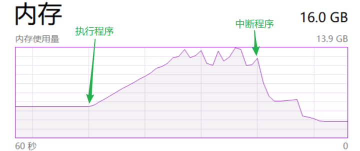
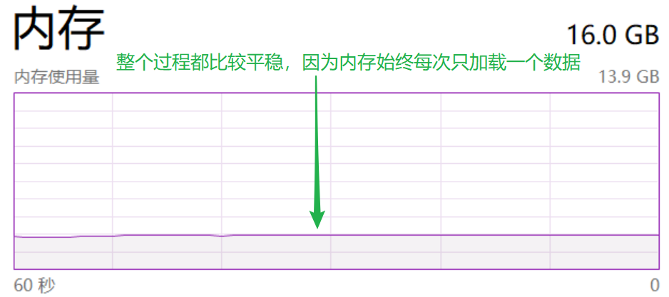

# 可迭代对象 & 迭代器 & 生成器

## 判断 Iterable、Iterator、Generator

- 从 collections 模块（或 typing 模块）中导入这三个类型，通过 isinstance 来判断对象类型

```python
from collections import Iterable, Iterator, Generator


num1 = 123
str1 = "abc"
list1 = [1, 2, 3]
tup1 = (1, 2, 3)
dict1 = {"one": 1, "two": 2, "three": 3}
set1 = {1, 2, 3}

"""Python标准数据类型中, 除了number, 其他都是可迭代对象, 即可以用for循环来遍历"""
print(isinstance(num1, Iterable))  # False
print(isinstance(str1, Iterable))  # True
print(isinstance(list1, Iterable))  # True
print(isinstance(tup1, Iterable))  # True
print(isinstance(dict1, Iterable))  # True
print(isinstance(set1, Iterable))  # True

print(isinstance(num1, Iterator))  # False
print(isinstance(str1, Iterator))  # False
print(isinstance(list1, Iterator))  # False
print(isinstance(tup1, Iterator))  # False
print(isinstance(dict1, Iterator))  # False
print(isinstance(set1, Iterator))  # False

print(isinstance(num1, Generator))  # False
print(isinstance(str1, Generator))  # False
print(isinstance(list1, Generator))  # False
print(isinstance(tup1, Generator))  # False
print(isinstance(dict1, Generator))  # False
print(isinstance(set1, Generator))  # False


""" range对象是可迭代对象 """
range1 = range(4)
print(isinstance(range1, Iterable))

""" reversed对象是迭代器 """
reversed1 = reversed([1, 3, 1, 4])
print(isinstance(reversed1, Iterator))

""" zip对象是迭代器 """
zip1 = zip([1, 2, 3], ["one", "two", "three"])
print(isinstance(zip1, Iterator))

""" enumerate对象是迭代器 """
enumerate1 = enumerate([1, 2, 3])
print(isinstance(enumerate1, Iterator))
```


## 可迭代对象

只要满足以下条件之一即可：

- 支持迭代协议（有_\_iter__()方法）
- 支持序列协议（有_\_getitem__()方法，且数字参数从0开始）

```python
num1 = 123
str1 = "abc"
list1 = [1, 2, 3]
tup1 = (1, 2, 3)
dict1 = {"one":1, "two":2, "three":3}
set1 = {1, 2, 3}
range1 = range(4)


""" str, list, tuple, dict, set, range对象都支持迭代协议, 所以他们都是可迭代对象
而 number 对象既不支持迭代协议，也不支持序列协议，因此它不是可迭代对象 """
print('__iter__' in dir(num1) or '__getitem__' in dir(num1))  # False
print('__iter__' in dir(str1))
print('__iter__' in dir(list1))
print('__iter__' in dir(tup1))
print('__iter__' in dir(dict1))
print('__iter__' in dir(set1))
print('__iter__' in dir(range1))
```


## 自定义可迭代对象

- 只要支持迭代协议或者序列协议即可

```python
from typing import Iterable


class MyObject1:
    def __init__(self):
        pass


mo1 = MyObject1()
print(isinstance(mo1, Iterable))  # False: 既不支持迭代协议, 也不支持序列协议


class MyObject2:
    def __init__(self):
        pass

    def __iter__(self):
        pass


mo2 = MyObject2()
print(isinstance(mo2, Iterable))  # True: 因为有__iter__()方法, 即支持迭代协议


class MyObject3:
    def __init__(self):
        pass

    def __getitem__(self, index):
        pass


mo3 = MyObject3()
print(isinstance(mo3, Iterable))  # False

"""
mo3支持序列协议, 为何 isinstance 判断为 False 呢?

注意: 使用 isinstance(obj, Iterable) 可以检测obj是否有__iter__()方法,
但是无法检测是否能够使用__getitem__()方法进行迭代
"""
```


## 迭代器

支持迭代器协议（注意区分迭代协议），即同时满足下面两个条件：

- 实现_\_iter__()方法
- 实现_\_next__()方法

```python
reversed1 = reversed([1, 3, 1, 4])
zip1 = zip([1, 2, 3], ["one", "two", "three"])
enumerate1 = enumerate([1, 2, 3])

print('__iter__' in dir(reversed1) and '__next__' in dir(reversed1))
print('__iter__' in dir(zip1) and '__next__' in dir(zip1))
print('__iter__' in dir(enumerate1) and '__next__' in dir(enumerate1))
```


## 自己创建迭代器

- 只要支持迭代器协议即可

```python
from typing import Iterator


class MyObject1:
    def __init__(self):
        pass


mo1 = MyObject1()
print(isinstance(mo1, Iterator))  # False: 不支持迭代器协议


class MyObject2:
    def __init__(self):
        pass

    def __iter__(self):
        pass


mo2 = MyObject2()
print(isinstance(mo2, Iterator))  # False: 不支持迭代器协议


class MyObject3:
    def __init__(self):
        pass

    def __iter__(self):
        pass
    
    def __next__(self):
        pass


mo3 = MyObject3()
print(isinstance(mo3, Iterator))  # True: 支持迭代器协议
```


## 迭代的逻辑

- [x] **迭代的时候，先找\_\_iter\_\_()方法，如果没有的话，再找\_\_getitem\_\_()方法**

- [x] **如果有_\_iter__()方法：**

  ① 可迭代对象里的\_\_iter\_\_()方法返回一个迭代器，通过迭代器里的\_\_next__()方法实现迭代

  ② 迭代器里的\_\_iter\_\_()方法返回它本身（因为迭代器协议中包含了迭代协议，所以迭代器也一定是可迭代对象，可迭代对象的\_\_iter\_\_()方法要返回一个迭代器，所以只需要返回本身即可）

  ③ 迭代器里的_\_next__()方法返回可迭代对象的下一项，如果没有下一项可返回，则抛出 StopIteration 异常

```python
class ContainerIterator:
    def __init__(self, container):
        self.container = container
        self.cursor = 0

    def __iter__(self):  # 对应第 ② 点
        return self

    def __next__(self):  # 对应第 ③ 点
        if self.cursor < len(self.container.iterable):
            item = self.container.iterable[self.cursor]
            self.cursor += 1
            return item
        raise StopIteration


class Container:
    def __init__(self, iterable):
        self.iterable = iterable

    def __iter__(self):  # 对应第 ① 点
        return ContainerIterator(self)


cont = Container([4, 5, 6])

"""
for语句在执行时会先调用可迭代对象的__iter__()方法, 得到该方法返回的迭代器对象,
然后每循环一次, 该迭代器对象调用一次__next__()方法, 通过__next__()方法来逐一返回元素,
当元素用尽时, __next__()方法将抛出StopIteration异常, 而for语句会捕获这个异常来break循环
"""
for item in cont:
    print(item)


""" for循环原理实现 """
cont_iterator = cont.__iter__()
while True:
    try:
        item = cont_iterator.__next__()
        print(item)
    except StopIteration:
        break


"""
除了for循环以外, 其他能够接收iterable参数的函数或方法大多都是基于类似原理,
比如: list()、tuple()、set()、sum()等等 """
print(list(cont))
print(tuple(cont))
print(set(cont))
print(sum(cont))


"""
迭代器也是可迭代对象, for语句在执行时会先调用迭代器的__iter__()方法,
而迭代器的__iter__()方法正好返回迭代器对象本身, 后面过程就是一样的了"""
cont_iterator = cont.__iter__()
for k in cont_iterator:
    print(k)


"""
同一个迭代器只能往前不会后退, 这里print(j)不会出结果, 是因为for语句遍历的
迭代器对象是cont_iterator, 在上文中该迭代器的self.cursor属性已经到了最大,
这里继续对同一个迭代器进行遍历, 执行__next__()方法将直接抛出异常, 结束循环 """
for j in cont_iterator:
    print(j)  # 没有输出

print(cont_iterator.__next__())  # 抛出 StopIteration 异常
```

​		

- [x] **如果只有_\_getitem__()方法：**

```python
class Container:
    def __init__(self, iterable):
        self.iterable = iterable

    def __getitem__(self, index):
        return self.iterable[index]


cont = Container([5, 6, 7])

"""
for语句在执行时, 先找__iter__()方法, 没有找到, 则找__getitem__()方法, 然后
每循环一次, 调用一次__getitem__()方法, 其中index参数从0开始, 无限递增+1, 当
index超出iterable索引范围抛出IndexError, for语句会捕获这个异常来break循环 """
for i in cont:
    print(i)


""" list()、tuple()、set()、sum()等也是基于类似原理 """
print(list(cont))
print(tuple(cont))
print(set(cont))
print(sum(cont))


""" 测试__getitem__()方法中的index参数 """
class MyObject:
    def __init__(self):
        pass

    def __getitem__(self, index):
        if index > 3:
            raise IndexError
        return index


mo = MyObject()
for i in mo:
    print(i)

print(list(mo))
print(tuple(mo))
print(set(mo))
```


## 生成器

- [x] 生成器写法类似于标准的函数写法，不同点在于：
  - 生成器用 yield 语句返回数据，而标准的函数用 return 语句返回数据
  - yield 语句返回数据之后会挂起函数的状态，并会记住上次执行语句时的所有数据值，方便每次在生成器调用_\_next__()方法时，从上次挂起的位置恢复继续执行，而 return 语句返回一次数据之后，函数就结束了

```python
from collections import Generator, Iterator


def func():
    print("The function body starts executing...")
    return 2
    print("The function body continues execution...")
    return 4
    print("ending...")


res = func()
print(res)


def gen():
    print("The function body starts executing...")
    yield 2
    print("The function body continues execution...")
    yield 4
    print("ending...")


"""
包含yield关键字的函数就是生成器函数, 调用生成器函数不会执行函数体代码,
而是直接返回一个生成器对象, 调用__next__()方法才会开始执行函数体代码 """
g = gen()  # 返回生成器对象
print(isinstance(g, Generator))  # True
print("__iter__" in dir(g) and "__next__" in dir(g))  # True: 生成器实现了迭代器协议
print(isinstance(g, Iterator))  # True: 生成器一定也是迭代器


"""
生成器对象调用__next__()方法就会开始执行函数体代码, 遇到 yield 则把
后面的数据返回, 然后挂起函数的状态, 直到下一次调用__next__()方法, 再
从挂起的状态继续往后执行, __next__()方法如果没有可以返回的值, 会抛出
StopIteration异常, 直到函数体执行完毕, 函数才算结束 """
print(g.__next__())
print(g.__next__())

""" 从上一步挂起状态继续往后执行, 输出: ending...
此时__next__()没有可以返回的值, 抛出 StopIteration 异常
函数体执行完毕, 函数结束 """
# print(g.__next__())


g2 = gen()  # g迭代完毕, 再建一个生成器

"""
生成器也是迭代器, 所以和迭代器逻辑是一样的, for语句在执行时会
先调用__iter__()方法, 返回self, 然后每次循环时, self调用一次
__next__()方法, 因为调用了该方法, 函数体就会开始执行, 执行到
yield, 把后面的数据返回, 然后函数挂起, 当循环又调用__next__()
方法时, 则从函数挂起处继续执行函数体, 而当没有 yield 时, 即没
有返回数据时, __next__()方法将引发 StopIteration 异常, for语
句会捕获这个异常来 break 循环 """
for i in g2:
    print(i)

""" list()、tuple()、set()、sum()等也是基于类似原理 """
print(list(g2))
print(tuple(g2))
print(set(g2))
print(sum(g2))
```

```python
def func3():
    return  # 相当于 return None


print(func3())  # None


def gen3():
    yield  # 相当于 yield None


g3 = gen3()
print(g3.__next__())  # None


def gen4():
    print("starting...")
    for _ in range(2):
        print(res1 := (1, 2))
        res2 = yield 4, 5
        print(res2)
        res3 = yield res1
        print(res3)
        print(res1)


g4 = gen4()

"""
1. 开始执行函数体, 输出: starting...
2. print(res1 := (1, 2))  输出: (1, 2)
3. 第一次遇到 yield, 返回 (4, 5), 函数挂起, 所以print(i) 输出: (4, 5)
4. 继续从挂起处迭代, 执行 res2 赋值操作, 由于 (4, 5) 已经被返回, 所以 res2 = None, print(res2) 输出: None
5. 往后执行第二次遇到 yield, 返回 res1, 函数挂起, 所以print(i) 输出: (1, 2)
6. 继续从挂起处迭代, 执行 res3 赋值操作, 由于 res1 已经被返回, 所以 res3 = None, print(res3) 输出: None
7. print(res1)  输出: (1, 2)
"""
for i in g4:
    print(i)
```


## 生成器表达式

- 生成器表达式所用语法类似列表推导式，只是外层为圆括号而非方括号
- 生成器表达式相比完整的生成器函数来说更紧凑，相比列表推导式则更为节省内存，因为列表推导式是一次构建一个结果列表，而生成器表达式返回的是一个生成器，再根据对生成器的处理函数按需迭代产生结果

```python
# 列表推导式
list1 = [i for i in range(5)]
print(type(list1))  # <class 'list'>
print(sum(list1))  # 10
print(sum(list1))  # 10


# 生成器表达式
gt1 = (i for i in range(5))
print(type(gt1))  # <class 'generator'>

"""
这里gt1第二次sum结果为什么是0, 而上面的list1却不是?
因为同一个gt1生成器对象, 第一次sum已经迭代完了, 而sum默认从0开始累加, 结果就为0
而每次sum(list1)都会通过list的__iter__()方法返回新的迭代器, 并不是同一个 """
print(sum(gt1))  # 10
print(sum(gt1))  # 0

""" 生成器表达式如果立即被外层的函数使用, 可以省略圆括号, 
而不用写成 sum((i for i in range(5))) """
print(sum(i for i in range(5)))  # 10
```


iter(object[,sentinel])

- 返回一个迭代器对象
- 如果没有第二个实参，object必须支持迭代协议（有\_\_iter\_\_()方法）或序列协议（有_\_getitem__()方法，且数字参数从0开始）。如果它不支持这些协议，会触发TypeError
- 如果有第二个实参sentinel，那么object必须是可调用的（函数、方法、lambda匿名函数、 类以及实现了 \_\_call\_\_ ()方法的实例对象）。这种情况下生成的迭代器，每次迭代调用它的_\_next__()方法时都会不带实参地调用object，返回调用的结果，如果返回的结果是sentinel，则触发StopIteration

```python
str1 = "abc"
list1 = [1, 2, 3]
tup1 = (1, 2, 3)
dict1 = {"one": 1, "two": 2, "three": 3}
set1 = {1, 2, 3}

# str1、list1、tup1、dict1、set1 支持迭代协议
print(iter(str1))
print(iter(list1))
print(iter(tup1))
print(iter(dict1))
print(iter(set1))


class MyObject:
    def __init__(self):
        pass

    def __getitem__(self, index):
        pass


# MyObject() 支持序列协议
print(iter(MyObject()))


class MyObject1:
    def __init__(self):
        self.num = 3

    def __call__(self):
        self.num += 1
        return self.num


"""
有第二个参数 sentinel = 7, 且 MyObject1() 是可调用对象, 则每次迭代时
调用 MyObject1()() 即调用 __call__方法, 当结果为 sentinel 时, 
触发StopIteration, 被list捕获, 停止迭代 """
call_iter = iter(MyObject1(), 7)
print(call_iter)
print(list(call_iter))  # [4, 5, 6]
```

​		next(iterator[, default])

- 通过调用 iterator 的 _\_next__() 方法获取下一个元素。如果迭代器耗尽，则返回给定的 default，如果没有默认值则触发 StopIteration

```python
str_iterator = iter("abcd")
print(next(str_iterator))  # "a"
print(next(str_iterator))  # "b"
print(next(str_iterator))  # "c"
print(next(str_iterator))  # "d"
print(next(str_iterator, "ef"))  # 迭代耗尽, 返回 "ef"
print(next(str_iterator))  # 迭代耗尽, 触发 StopIteration
```


## 迭代器的优缺点

**迭代器优点:**

- 提供了一种不依赖索引的迭代取值方式
- 节省内存，迭代器在内存中相当于只占一个数据的空间：因为每次取值上一条数据都会在内存释放，再加载当前的此条数据，而不需要一次性把所有数据加载到内存当中
- 执行列表推导式：sum([i for i in range(10000000000)])  的内存使用情况



- 执行生成器表达式：sum(i for i in range(10000000000)) 的内存使用情况

  

**迭代器缺点:**

- 取值不如按照索引的方式灵活，不能取指定的某一个值，只能往后取，不能往前去
- 除非取尽，否则无法获取迭代器的长度


## 小结

- 生成器也是迭代器，因为都实现了迭代器协议；
- 迭代器、生成器都是可迭代对象，因为都实现了迭代协议；
- 但是可迭代对象不一定是迭代器。